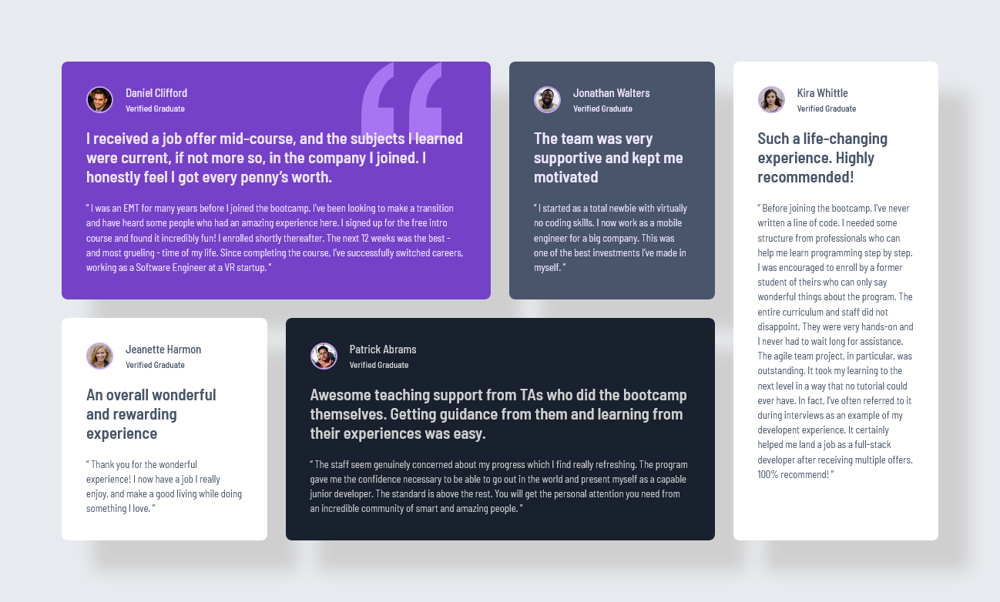

# Frontend Mentor - Testimonials grid section solution

This is a solution to the [Testimonials grid section challenge on Frontend Mentor](https://www.frontendmentor.io/challenges/testimonials-grid-section-Nnw6J7Un7). Frontend Mentor challenges help you improve your coding skills by building realistic projects. 

## Table of contents

- [Overview](#overview)
  - [The challenge](#the-challenge)
  - [Screenshot](#screenshot)
  - [Links](#links)
- [My process](#my-process)
  - [Built with](#built-with)
  - [What I learned](#what-i-learned)
  - [Useful resources](#useful-resources)

## Overview

### The challenge

Users should be able to:

- View the optimal layout for the site depending on their device's screen size

### Screenshot


Here is a screenshot of the desktop solution:



--

Here is a screenshot of the mobile solution:


### Links

- Solution URL: [Frontend Mentor](https://www.frontendmentor.io/solutions/testimonials-grid-section-rJkuwqRRlP)
- Live Site URL: [Vercel.com](https://testimonials-grid-section-three-pearl.vercel.app/)

## My process

### Built with

- Semantic HTML5 markup
- CSS custom properties
- Sass
- BEM (Block Element Modifier)
- Flexbox
- CSS Grid
- Mobile-first workflow

### What I learned

**HTML structure using BEM**

- Built a clean and semantic HTML structure.

- Applied the BEM (Block Element Modifier) naming convention for class names, e.g., `testimonial__card--daniel`

**SCSS (Sass)**
Organized CSS using SCSS features:

 - Element Nesting:

    ```scss
      .card{
        &__title{
            font-size: .9rem;
            font-weight: $font-weight500;
        }
        &__status{
            font-size: .7rem;
            font-weight: $font-weight500;
        }
      }
    ``` 
- Declared variables for consistent color usage.

**CSS Grid Layout**

- Used CSS Grid to build complex, responsive layouts.

- Distributed testimonial cards across the grid based on screen size.

### Useful resources

- [ChatGPT (OpenAI)](https://chatgpt.com/) - This helped me understand how different CSS properties work together, especially layout behavior and default styles. I used it as a coding assistant whenever I had a doubt.
- [Abdelrahman Gamal](https://nouvil.net/) - His tutorials are super beginner-friendly and helped me understand the basics of HTML and CSS. I really appreciated his clear explanations and structured approach to learning front-end development.
- [W3Schools](https://www.w3schools.com) - I used this site a lot to review syntax, explore new CSS properties, and test small snippets of code. It's really helpful for quick references and hands-on practice while learning.
- [Nour Homsi](https://www.youtube.com/@NourHomsi) - His Sass crash course gave me a great introduction to SCSS. I learned about nesting, variables, partials, and how to compile Sass using extensions. His video was clear, practical, and beginner-friendly.